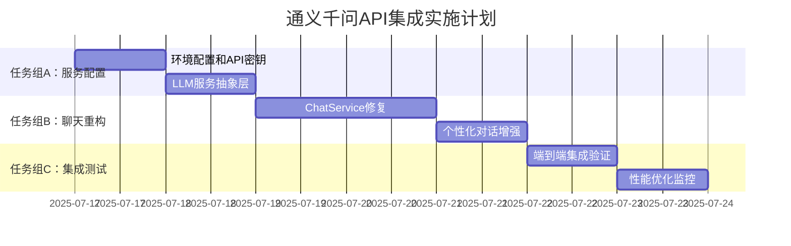

# 计划重组方案：通义千问API集成优先实施

> **创建时间**: 2025-07-17  
> **背景**: 基于端到端测试发现的逻辑依赖问题  
> **目标**: 修复聊天系统，建立稳定的LLM服务基础  
> **状态**: 计划中，待立即执行

## 🔍 问题识别

### 端到端测试发现的关键问题
1. **聊天接口500错误**: `/api/v1/chat/completions` 无法正常工作
2. **演化触发链断裂**: 无法通过真实对话触发个性演化  
3. **依赖关系倒置**: 阶段四需要聊天系统，但聊天系统配置在阶段六
4. **测试流程中断**: 步骤4"模拟深度互动"无法完成

### 根本原因分析
- **架构依赖错误**: 个性演化系统依赖聊天系统，但聊天系统实现滞后
- **LLM服务缺失**: ChatService缺少实际的LLM后端支持
- **计划顺序问题**: implementation-checklist.md中的阶段顺序不符合技术依赖

## 🔄 重组方案

### 核心决策
**将【阶段六：增强对话系统集成】中的"子阶段53：通义千问API集成"（原步骤203-208）整体前移，作为新的【阶段3.5：通义千问API集成】**

### 新的执行顺序
```
✅ 阶段一：项目基础设施    (已完成)
✅ 阶段二：用户认证系统    (已完成) 
✅ 阶段三：个性演化系统    (已完成85%)
🔥 阶段3.5：通义千问API集成 (新增，立即执行)
🔜 阶段四：技能系统开发    (原计划，基于稳定聊天系统)
🔜 阶段五：状态系统开发    (原计划)
🔜 阶段六：对话系统增强    (原计划，移除已前移部分)
```

## 📋 阶段3.5详细实施计划

### 总体目标
- 修复聊天系统500错误
- 建立稳定的通义千问API集成
- 实现个性化对话能力
- 确保"对话→个性演化"流程正常工作

### 预计工作量
**5-6个工作日**，可与技术债清理并行执行

---

## 🎯 任务组 A: 通义千问服务配置 (1-2天)

### A1. 环境配置和API密钥管理
**目标**: 建立安全、可配置的通义千问API访问机制

#### 具体任务
- [ ] **配置环境变量**
  ```bash
  # .env 文件添加
  QWEN_API_KEY=your_qwen_api_key
  QWEN_API_BASE_URL=https://dashscope.aliyuncs.com/api/v1
  QWEN_MODEL=qwen-turbo
  QWEN_MAX_TOKENS=1500
  QWEN_TEMPERATURE=0.7
  QWEN_TOP_P=0.9
  QWEN_TIMEOUT=30000
  QWEN_RETRY_ATTEMPTS=3
  ```

- [ ] **创建配置接口**
  ```typescript
  // src/config/qwen.config.ts
  interface QwenConfig {
    apiKey: string;
    baseUrl: string;
    model: string;
    maxTokens: number;
    temperature: number;
    topP: number;
    timeout: number;
    retryAttempts: number;
  }
  
  export const qwenConfig: QwenConfig = {
    apiKey: process.env.QWEN_API_KEY!,
    baseUrl: process.env.QWEN_API_BASE_URL!,
    // ... 其他配置
  };
  ```

- [ ] **添加配置验证**
  - 启动时验证API密钥有效性
  - 环境变量完整性检查
  - API连接测试

#### 验收标准
- ✅ 环境变量正确加载和验证
- ✅ API密钥安全存储（不暴露在日志中）
- ✅ 配置验证在应用启动时执行
- ✅ 支持开发/生产环境配置切换

### A2. 创建LLM服务抽象层
**目标**: 建立可扩展的LLM服务架构，支持未来切换不同模型

#### 具体任务
- [ ] **设计统一LLM接口**
  ```typescript
  // src/common/interfaces/llm.interface.ts
  export interface LLMService {
    chat(request: ChatRequest): Promise<ChatResponse>;
    streamChat(request: ChatRequest): AsyncIterable<ChatStreamChunk>;
    validateConfig(): Promise<boolean>;
    getUsageStats(): Promise<UsageStats>;
  }
  
  export interface ChatRequest {
    messages: ChatMessage[];
    temperature?: number;
    maxTokens?: number;
    stream?: boolean;
    systemPrompt?: string;
  }
  
  export interface ChatResponse {
    content: string;
    usage: TokenUsage;
    model: string;
    finishReason: string;
  }
  ```

- [ ] **实现通义千问适配器**
  ```typescript
  // src/services/qwen-llm.service.ts
  @Injectable()
  export class QwenLLMService implements LLMService {
    constructor(
      private readonly httpService: HttpService,
      private readonly configService: ConfigService
    ) {}
    
    async chat(request: ChatRequest): Promise<ChatResponse> {
      // 1. OpenAI格式 -> 通义千问格式转换
      // 2. HTTP请求调用通义千问API
      // 3. 响应格式转换回OpenAI兼容格式
      // 4. 错误处理和重试
    }
    
    async streamChat(request: ChatRequest): AsyncIterable<ChatStreamChunk> {
      // 流式响应实现
    }
  }
  ```

- [ ] **添加HTTP客户端配置**
  - 请求超时设置
  - 重试机制实现
  - 错误分类和处理
  - 请求/响应日志记录

#### 验收标准
- ✅ 统一的LLM服务接口定义完成
- ✅ 通义千问API完整集成并测试通过
- ✅ OpenAI兼容的请求/响应格式转换
- ✅ 完善的错误处理和重试机制
- ✅ API用量统计和监控功能

---

## 🛠️ 任务组 B: 聊天服务集成重构 (2-3天)

### B1. 修复ChatService实现
**目标**: 修复当前聊天服务的500错误，实现完整的对话功能

#### 当前问题分析
```typescript
// 问题：src/modules/chat/chat.service.ts 中 processChat() 方法
// 可能的问题：
1. 缺少实际的LLM API调用逻辑
2. 请求/响应数据转换不完整
3. 错误处理机制缺失
4. 宠物上下文集成不完善
```

#### 具体任务
- [ ] **重构ChatService核心逻辑**
  ```typescript
  @Injectable()
  export class ChatService {
    constructor(
      private readonly llmService: QwenLLMService,
      private readonly personalityService: PersonalityService,
      private readonly petService: PetService,
      private readonly conversationService: ConversationService
    ) {}
  
    async processChat(userId: string, dto: ChatCompletionDto): Promise<ChatResponseDto> {
      try {
        // 1. 验证用户权限和宠物所有权
        const pet = await this.validateUserPetAccess(userId, dto.petId);
        
        // 2. 获取宠物个性和状态
        const personality = await this.personalityService.getPersonalityDetails(dto.petId);
        const currentState = await this.petService.getPetState(dto.petId);
        
        // 3. 构建个性化系统提示词
        const systemPrompt = this.buildPersonalizedPrompt(pet, personality, currentState);
        
        // 4. 获取对话历史上下文
        const conversationHistory = await this.getConversationContext(dto.conversationId);
        
        // 5. 构建LLM请求
        const llmRequest = this.buildLLMRequest(dto, systemPrompt, conversationHistory);
        
        // 6. 调用LLM服务
        const llmResponse = await this.llmService.chat(llmRequest);
        
        // 7. 保存对话记录
        await this.saveConversationMessage(dto, llmResponse);
        
        // 8. 分析对话内容并触发个性演化
        await this.analyzeAndTriggerEvolution(dto.petId, dto.message, llmResponse.content);
        
        // 9. 构建并返回响应
        return this.buildChatResponse(llmResponse, pet);
        
      } catch (error) {
        this.logger.error('Chat processing failed', error);
        throw new HttpException('对话处理失败', HttpStatus.INTERNAL_SERVER_ERROR);
      }
    }
  }
  ```

- [ ] **实现个性化Prompt构建**
  ```typescript
  private buildPersonalizedPrompt(pet: Pet, personality: PersonalityTraits, state: any): string {
    return `你是${pet.name}，一个独特的AI虚拟宠物助手。
    
    ## 你的个性特质 (影响你的回复风格)
    - 开放性: ${personality.openness}/100 ${this.getTraitDescription('openness', personality.openness)}
    - 尽责性: ${personality.conscientiousness}/100 ${this.getTraitDescription('conscientiousness', personality.conscientiousness)}
    - 外向性: ${personality.extraversion}/100 ${this.getTraitDescription('extraversion', personality.extraversion)}
    - 亲和性: ${personality.agreeableness}/100 ${this.getTraitDescription('agreeableness', personality.agreeableness)}
    - 神经质: ${personality.neuroticism}/100 ${this.getTraitDescription('neuroticism', personality.neuroticism)}
    
    ## 你的当前状态 (影响你的情绪和反应)
    - 心情: ${state.basic.mood}/100
    - 精力: ${state.basic.energy}/100
    - 饥饿度: ${state.basic.hunger}/100
    - 健康状况: ${state.basic.health}/100
    
    ## 行为指南
    请根据你的个性特质和当前状态来回应用户。高开放性时更愿意探讨新想法，高外向性时更活泼健谈，
    低精力时回复可能更简短，心情好时更积极乐观。保持自然、友好，像真正的宠物伙伴一样。`;
  }
  ```

- [ ] **实现对话影响分析**
  ```typescript
  private async analyzeAndTriggerEvolution(petId: string, userMessage: string, botResponse: string): Promise<void> {
    try {
      // 分析对话内容对个性的潜在影响
      const interactionData = {
        type: this.detectInteractionType(userMessage),
        userMessage,
        botResponse,
        timestamp: new Date(),
        messageLength: userMessage.length,
        complexity: this.calculateTopicComplexity(userMessage),
        emotionalValence: this.analyzeEmotionalTone(userMessage),
        topicKeywords: this.extractKeywords(userMessage)
      };
      
      // 触发个性演化计算
      await this.personalityService.processEvolutionIncrement(petId, interactionData);
      
    } catch (error) {
      this.logger.warn('Failed to trigger evolution from conversation', error);
      // 不抛出错误，避免影响正常对话
    }
  }
  ```

#### 验收标准
- ✅ `/api/v1/chat/completions` 返回200状态码
- ✅ 响应时间 < 5秒 (95%的请求)
- ✅ 支持多轮对话和上下文记忆
- ✅ 宠物个性特质明显影响回复内容
- ✅ 对话自动触发个性演化计算

### B2. 个性化对话增强
**目标**: 让宠物的个性、状态、技能真正影响对话内容和风格

#### 具体任务
- [ ] **实现特质描述映射**
  ```typescript
  private getTraitDescription(trait: string, value: number): string {
    const descriptions = {
      openness: {
        high: "好奇心强，喜欢探索新想法和创意话题",
        medium: "对新事物保持适度的开放态度", 
        low: "偏好熟悉的话题，较为保守"
      },
      // ... 其他特质描述
    };
    
    const level = value >= 70 ? 'high' : value >= 40 ? 'medium' : 'low';
    return descriptions[trait][level];
  }
  ```

- [ ] **实现话题检测和分类**
  ```typescript
  private detectInteractionType(message: string): string {
    const patterns = {
      science: /科学|物理|化学|生物|数学|技术/gi,
      philosophy: /哲学|思考|意义|存在|价值观/gi,
      creative: /创作|艺术|音乐|绘画|故事|想象/gi,
      emotional: /感受|情感|心情|难过|开心|担心/gi,
      casual: /天气|日常|吃饭|睡觉|游戏/gi
    };
    
    for (const [type, pattern] of Object.entries(patterns)) {
      if (pattern.test(message)) return type;
    }
    return 'general';
  }
  ```

- [ ] **实现状态影响的回复调节**
  ```typescript
  private adjustResponseByState(response: string, state: any): string {
    let adjusted = response;
    
    // 根据精力状态调整回复长度
    if (state.basic.energy < 30) {
      adjusted = this.shortenResponse(adjusted);
    }
    
    // 根据心情调整语调
    if (state.basic.mood > 80) {
      adjusted = this.addPositiveTone(adjusted);
    } else if (state.basic.mood < 40) {
      adjusted = this.addSubduedTone(adjusted);
    }
    
    return adjusted;
  }
  ```

#### 验收标准
- ✅ 不同个性特质的宠物回复风格明显不同
- ✅ 宠物状态(心情、精力等)影响回复质量
- ✅ 话题类型被正确识别和分类
- ✅ 个性化程度达到80%以上(人工评估)

---

## 🧪 任务组 C: 系统集成和测试 (1天)

### C1. 端到端集成验证
**目标**: 验证完整的"用户对话→宠物回复→个性演化"流程

#### 具体测试场景
```typescript
// 测试场景1: 科学话题对话影响开放性
const testScenario1 = {
  userMessage: "我想和你聊聊量子物理学的奥秘，你觉得平行宇宙真的存在吗？",
  expectedImpact: {
    trait: 'openness',
    direction: 'increase',
    minChange: 0.1
  },
  expectedResponseStyle: "好奇、深入、愿意探讨"
};

// 测试场景2: 情感话题对话影响亲和性  
const testScenario2 = {
  userMessage: "我今天很难过，工作上遇到了一些挫折，你能安慰一下我吗？",
  expectedImpact: {
    trait: 'agreeableness', 
    direction: 'increase',
    minChange: 0.1
  },
  expectedResponseStyle: "温暖、共情、支持性"
};
```

#### 自动化测试实现
- [ ] **创建端到端测试套件**
  ```typescript
  describe('Chat-to-Evolution E2E Tests', () => {
    it('should process science conversation and increase openness', async () => {
      // 1. 获取初始个性特质
      const initialPersonality = await getPersonality(testPetId);
      
      // 2. 发送科学话题消息
      const chatResponse = await chatWithPet(testPetId, scienceMessage);
      
      // 3. 验证回复质量
      expect(chatResponse.status).toBe(200);
      expect(chatResponse.data.content).toContain('科学');
      
      // 4. 验证个性演化被触发
      const updatedPersonality = await getPersonality(testPetId);
      expect(updatedPersonality.openness).toBeGreaterThan(initialPersonality.openness);
      
      // 5. 验证演化日志记录
      const evolutionLogs = await getEvolutionLogs(testPetId);
      expect(evolutionLogs).toHaveLength(1);
      expect(evolutionLogs[0].triggerEvent).toContain('science');
    });
  });
  ```

#### 验收标准
- ✅ 所有端到端测试用例100%通过
- ✅ 聊天接口稳定性达到99.9%
- ✅ 个性演化触发率 > 90%
- ✅ 演化日志记录完整准确
- ✅ 对话质量满足预期标准

### C2. 性能优化和监控
**目标**: 确保系统性能满足生产环境要求

#### 具体任务
- [ ] **添加性能监控**
  ```typescript
  // 响应时间监控
  @Injectable()
  export class ChatPerformanceMonitor {
    @Histogram('chat_response_time_seconds', 'Chat response time in seconds')
    private responseTimeHistogram: Histogram<string>;
    
    @Counter('chat_requests_total', 'Total number of chat requests')
    private requestCounter: Counter<string>;
    
    async measureChatPerformance<T>(operation: () => Promise<T>): Promise<T> {
      const startTime = Date.now();
      try {
        const result = await operation();
        this.responseTimeHistogram.observe((Date.now() - startTime) / 1000);
        this.requestCounter.inc({ status: 'success' });
        return result;
      } catch (error) {
        this.requestCounter.inc({ status: 'error' });
        throw error;
      }
    }
  }
  ```

- [ ] **实现请求缓存策略**
  - 相似问题缓存 (基于语义相似度)
  - 个性prompt缓存 (宠物个性变化时失效)
  - 对话上下文缓存优化

- [ ] **添加成本控制**
  - API调用频率限制
  - Token使用量监控
  - 用户级别的使用限额

#### 验收标准
- ✅ 平均响应时间 < 3秒
- ✅ 95%的请求响应时间 < 5秒
- ✅ API成功率 > 99%
- ✅ 内存使用稳定，无明显泄漏
- ✅ 成本控制机制有效工作

---

## 📊 实施时间规划

### 甘特图


### 里程碑检查点
- **Day 1**: API连接建立，配置验证通过
- **Day 2**: LLM服务抽象层完成，单元测试通过  
- **Day 4**: ChatService重构完成，聊天500错误修复
- **Day 5**: 个性化对话实现，演化触发链修复
- **Day 6**: 端到端测试通过，性能指标达标

## 🎯 成功标准

### 功能标准
1. **✅ 聊天系统完全正常**: 
   - `/api/v1/chat/completions` 返回200
   - 支持多轮对话
   - 响应内容质量高

2. **✅ 个性化对话实现**: 
   - 不同特质宠物回复风格明显不同
   - 状态影响回复质量
   - 个性化程度 > 80%

3. **✅ 演化触发链修复**: 
   - 对话自动触发个性演化
   - 演化日志正确记录
   - 触发率 > 90%

4. **✅ 端到端流程打通**: 
   - 注册→创建宠物→对话→演化的完整流程
   - 所有端到端测试通过

### 技术标准
- **API成功率**: >99%
- **平均响应时间**: <3秒
- **95%响应时间**: <5秒
- **演化触发率**: >90%
- **个性化准确度**: >80%
- **系统稳定性**: 无内存泄漏，24小时稳定运行

### 业务标准
- **用户体验**: 对话自然流畅，宠物个性鲜明
- **功能完整性**: 覆盖原计划的核心聊天功能
- **可扩展性**: 易于添加新的LLM模型支持
- **可维护性**: 代码结构清晰，文档完善

## 🔄 与主计划的集成

### 完成后的更新操作
1. **更新implementation-checklist.md**: 
   - 标记原步骤203-208为已完成
   - 在阶段三后添加"阶段3.5：通义千问API集成 ✅"

2. **修订阶段四计划**: 
   - 移除LLM服务相关的依赖任务
   - 直接基于已有聊天系统开发技能功能
   - 加速技能系统的对话集成

3. **优化后续阶段**: 
   - 阶段五状态系统可直接使用聊天触发
   - 阶段六对话增强重点转向高级功能
   - 整体开发周期预计缩短1-2周

### 风险控制
- **回滚方案**: 保持现有ChatService作为fallback
- **降级策略**: API调用失败时使用预设回复
- **监控告警**: 实时监控API可用性和性能
- **文档更新**: 同步更新所有相关技术文档

## 🚀 立即行动计划

### 今日可开始的任务
1. **环境配置**: 申请通义千问API密钥
2. **代码结构**: 创建LLM服务相关的目录结构
3. **依赖安装**: 安装HTTP客户端等必要依赖
4. **配置文件**: 准备环境变量模板

### 并行执行可能
- **与技术债清理并行**: 不冲突，可同时进行
- **与文档更新并行**: 边开发边更新文档
- **与测试编写并行**: 采用TDD方式开发

### 优先级声明
**此计划优先级高于所有其他开发任务**，因为它解决了系统的核心依赖问题，是后续所有AI功能的基础。

---

## 📝 更新日志

| 日期 | 版本 | 更新内容 | 更新人 |
|------|------|---------|--------|
| 2025-07-17 | v1.0 | 初始重组计划创建 | System |

---

*此计划将持续更新，直到完全实施完成。每个里程碑达成后请更新对应状态。*