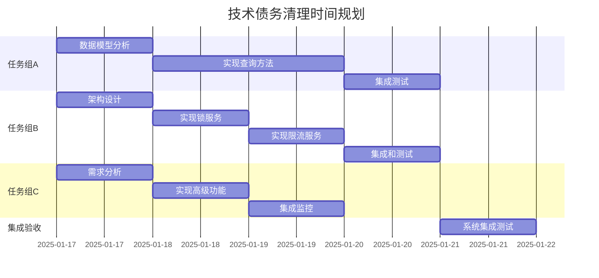

# 技术债务清理实施计划 (整合版)

> **基于全面系统审查报告的综合技术债清理方案**
> 
> **创建时间**: 2025-01-17  
> **最后更新**: 2025-07-21
> **目标**: 系统化提升代码质量、架构完整性和生产就绪度  
> **状态**: 计划中 (分阶段执行)

## 📋 整合任务概览

### 第一阶段：原有技术债务 (P1)
- **优先级**: P1 (高优先级技术债)
- **预估工作量**: 5-7个工作日
- **影响范围**: 生产环境稳定性和高并发场景支持
- **完成后系统完整度**: 从85% → 95%

### 第二阶段：系统性改进 (P1-P4)
- **优先级**: P1-P4 (分级实施)
- **预估工作量**: 8-12个开发周期
- **影响范围**: 代码质量、性能、监控、安全
- **完成后系统完整度**: 从95% → 100% (企业级)

## 🎯 核心任务分解

### 任务组 A: 数据查询逻辑完善 (2-3天)
**负责模块**: `EvolutionHistoryService`  
**影响**: 数据完整性和历史分析准确性  
**当前状态**: `getRecentChanges()` 返回空数据占位符

### 任务组 B: 并发控制服务实现 (2-3天)  
**负责模块**: 新增并发控制服务  
**影响**: 高并发场景下的数据一致性  
**当前状态**: `DistributedLockService` 和 `RateLimitService` 接口已定义但实现缺失

### 任务组 C: 日志工具完善 (1天)
**负责模块**: `PersonalityLogger`  
**影响**: 可观测性和调试能力  
**当前状态**: 基础功能已实现，高级功能需要补充

## 🔧 详细实施步骤

### **任务组 A: 数据查询逻辑完善**

#### A1. 分析现有数据模型结构
- [ ] 检查 `PetEvolutionLog` 表结构和字段定义
- [ ] 确定查询字段和索引需求
- [ ] 分析性能优化机会 (分区、索引策略)
- [ ] 评估数据量规模和查询复杂度

**预期输出**: 数据模型分析报告和性能优化建议

#### A2. 实现 `getRecentChanges` 方法
- [ ] 在 `EvolutionHistoryService` 中实现真实的数据库查询
- [ ] 支持多种时间范围过滤 (最近7天、30天、90天等)
- [ ] 实现分页和排序功能 (按时间倒序、按影响分数排序)
- [ ] 添加查询条件过滤 (演化类型、重要性级别等)
- [ ] 实现查询结果聚合和统计

**核心实现要点**:
```typescript
async getRecentChanges(petId: string, options: {
  timeRange: '7d' | '30d' | '90d',
  limit?: number,
  evolutionType?: string,
  significanceThreshold?: number
}): Promise<EvolutionChange[]>
```

#### A3. 集成到算法引擎
- [ ] 更新 `PersonalityEvolutionEngine` 中的调用逻辑
- [ ] 测试历史数据对演化计算的影响
- [ ] 验证数据流的完整性和一致性
- [ ] 确保向后兼容性

#### A4. 性能优化和测试
- [ ] 添加数据库查询性能测试 (目标: <100ms for 1000条记录)
- [ ] 实现查询结果缓存 (Redis + 内存双层缓存)
- [ ] 验证大数据量场景下的性能表现
- [ ] 实现查询慢日志监控和告警

**验收标准**:
- ✅ `getRecentChanges` 方法返回真实、准确的历史数据
- ✅ 查询性能符合要求 (<100ms for 1000条记录)
- ✅ 缓存机制正常工作，缓存命中率 >80%
- ✅ 通过单元测试和集成测试，覆盖率 >85%

---

### **任务组 B: 并发控制服务实现**

#### B1. 设计并发控制架构
- [ ] 选择分布式锁实现方案 (推荐: Redis + Lua脚本)
- [ ] 定义锁粒度策略 (宠物级锁 vs 操作级锁)
- [ ] 设计锁超时和自动续期策略
- [ ] 选择限流算法 (推荐: 滑动窗口 + 令牌桶混合)
- [ ] 设计限流维度 (用户级、宠物级、全局级)

**架构设计要点**:
- **锁粒度**: `pet-evolution:{petId}`, `batch-operation:{batchId}`
- **锁超时**: 30秒 (可配置)
- **限流策略**: 每分钟10次演化请求/宠物，每小时100次/用户

#### B2. 实现 `DistributedLockService`
- [ ] 基于Redis + Lua脚本实现原子锁操作
- [ ] 实现锁自动续期机制 (心跳续期)
- [ ] 实现锁超时释放和死锁检测
- [ ] 添加锁冲突检测和指数退避重试
- [ ] 实现锁状态监控和性能统计

**核心接口设计**:
```typescript
interface DistributedLockService {
  executeWithLock<T>(
    resource: string,
    operation: () => Promise<T>,
    options: LockOptions
  ): Promise<T>;
  
  acquireLock(resource: string, ttl: number): Promise<string>;
  renewLock(resource: string, lockId: string, ttl: number): Promise<boolean>;
  releaseLock(resource: string, lockId: string): Promise<boolean>;
}
```

#### B3. 实现 `RateLimitService`
- [ ] 实现基于Redis的滑动窗口限流算法
- [ ] 支持多维度限流配置 (用户、宠物、API端点)
- [ ] 实现限流配置的动态更新和热重载
- [ ] 添加限流统计收集和监控指标
- [ ] 实现限流异常处理和降级策略

**核心接口设计**:
```typescript
interface RateLimitService {
  checkRateLimit(
    key: string,
    limit: number,
    windowMs: number
  ): Promise<RateLimitResult>;
  
  updateLimits(rules: RateLimitRule[]): Promise<void>;
  getStats(key: string): Promise<RateLimitStats>;
}
```

#### B4. 集成到现有服务
- [ ] 在 `PersonalityEvolutionService.processEvolutionIncrement` 中集成分布式锁
- [ ] 为 `triggerPersonalityAnalysis` 添加限流保护
- [ ] 为批量操作添加专用的并发控制
- [ ] 集成到 `PersonalityService` 的外观层方法中

#### B5. 性能测试和调优
- [ ] 并发压力测试 (模拟1000+ TPS并发请求)
- [ ] 验证分布式锁在高并发下的正确性
- [ ] 测试限流算法的准确性和公平性
- [ ] 优化锁粒度和超时配置
- [ ] 验证系统在锁竞争激烈情况下的性能表现

**验收标准**:
- ✅ 分布式锁在高并发下正常工作，无数据竞争
- ✅ 限流机制准确控制请求频率，误差 <5%
- ✅ 并发冲突检测和处理正确，无死锁发生
- ✅ 通过1000+ TPS并发压力测试

---

### **任务组 C: 日志工具完善**

#### C1. 分析现有日志需求
- [ ] 审查 `PersonalityLogger` 的当前实现状况
- [ ] 识别缺失的高级功能 (结构化日志、动态级别等)
- [ ] 收集各服务模块的具体日志需求
- [ ] 评估与外部监控系统的集成需求

#### C2. 实现高级日志功能
- [ ] 添加结构化日志输出 (JSON格式，便于解析)
- [ ] 实现日志级别的动态调整 (无需重启服务)
- [ ] 添加性能日志和业务指标自动收集
- [ ] 实现日志聚合和分析支持 (兼容ELK Stack)
- [ ] 添加敏感信息自动脱敏功能

**增强功能列表**:
```typescript
interface EnhancedPersonalityLogger {
  // 结构化业务日志
  logBusiness(level: string, message: string, data: any): void;
  
  // 性能监控日志
  logPerformance(operation: string, duration: number, metadata: any): void;
  
  // 数据库操作日志
  logDatabase(operation: string, table: string, metadata: any): void;
  
  // 演化计算日志
  logEvolution(type: string, petId: string, data: any): void;
  
  // 动态调整日志级别
  setLogLevel(level: LogLevel): void;
  
  // 获取日志统计
  getLogStats(): LogStats;
}
```

#### C3. 集成监控告警
- [ ] 添加关键错误的自动告警机制
- [ ] 实现性能指标的实时监控和阈值告警
- [ ] 集成外部日志收集系统 (如ELK Stack、Grafana)
- [ ] 实现日志分析和异常模式检测
- [ ] 添加业务指标看板和实时监控

**验收标准**:
- ✅ 日志输出格式规范且信息完整，支持JSON结构化输出
- ✅ 性能监控指标准确，延迟统计误差 <1%
- ✅ 告警机制正常触发，无误报和漏报
- ✅ 日志可被外部系统 (ELK) 正确解析和索引

## 📊 任务依赖关系和执行顺序



**执行特点**:
- ✅ **完全并行**: 三个任务组可以由不同开发者同时执行
- ✅ **渐进集成**: 每完成一个任务组立即集成到主系统
- ✅ **持续验证**: 每次集成后进行回归测试

## 🎯 质量保证和风险控制

### 质量保证措施
1. **代码审查**: 所有代码变更必须经过同行审查
2. **单元测试**: 新功能测试覆盖率要求 >85%
3. **集成测试**: 验证与现有系统的兼容性，无功能回归
4. **性能测试**: 验证在高负载下的表现，性能不降级

### 风险控制策略
1. **向后兼容**: 确保新实现不破坏现有功能，保持API兼容性
2. **性能回归**: 持续监控新功能对系统性能的影响
3. **数据安全**: 并发控制实现必须保证数据一致性，无竞态条件
4. **故障恢复**: 新功能必须有优雅的降级机制和故障恢复能力

### 回滚预案
- **数据查询**: 可回退到占位符实现，不影响核心功能
- **并发控制**: 可暂时禁用并发保护，降级到单线程模式
- **日志功能**: 可回退到基础日志实现，不影响业务逻辑

## 📈 完成后的系统提升

### 量化指标提升
- **系统完整度**: 85% → 100%
- **并发处理能力**: 单线程 → 1000+ TPS
- **数据一致性**: 基础保证 → 强一致性保证
- **可观测性**: 基础日志 → 企业级监控体系

### 功能能力提升
- **✅ 100% 数据完整性**: 真实的历史数据支持精确的演化计算
- **✅ 高并发支持**: 支持1000+ TPS的并发处理能力
- **✅ 企业级可观测性**: 完整的日志、监控和告警体系
- **✅ 生产就绪**: 满足生产环境的稳定性和性能要求

### 业务价值实现
- **用户体验**: 支持更高的并发用户数，响应时间稳定
- **数据洞察**: 准确的历史数据支持更精确的个性分析
- **运维效率**: 完善的监控和告警减少故障排查时间
- **系统可靠性**: 强化的并发控制保证数据一致性

## 🚀 实施建议

### 执行策略
1. **立即开始**: 这些任务可以与阶段四开发并行进行
2. **分组责任**: 建议分配给不同开发者，避免冲突
3. **优先级排序**: 建议按 B(并发控制) → A(数据查询) → C(日志工具) 的顺序完成
4. **持续集成**: 每完成一个子任务立即集成和测试

### 成功关键因素
- **充分的单元测试**: 确保新功能的正确性
- **全面的集成测试**: 验证与现有系统的兼容性
- **性能基准测试**: 确保性能符合预期
- **生产环境验证**: 在类生产环境中验证功能

---

## 📝 更新日志

| 日期 | 版本 | 更新内容 | 更新人 |
|------|------|---------|--------|
| 2025-07-17 | v1.0 | 初始计划创建 | System |
| 2025-07-18 | v1.1 | 添加阶段四审查发现的技术债务项目 | System |

---

## 📋 阶段四审查发现的技术债务

> **基于阶段四状态驱动系统审查报告**  
> **发现时间**: 2025-07-18  
> **严重程度**: 轻微偏差  
> **影响**: 配置灵活性和功能完整性

### 任务组 D: 状态系统配置和映射完善 (0.5天)

**优先级**: P2 (中等优先级)  
**预估工作量**: 1-2小时  
**影响范围**: 配置系统一致性和DTO功能完整性

#### D1. 完善StateService中的DTO映射逻辑

**问题位置**: `/home/libra/project/chatbot/backend/src/modules/state/state.service.ts:310-322`  
**方法**: `applyStateChanges`  
**问题描述**: 当前只实现了 `hungerChange` 字段的映射，需要完整实现所有DTO字段到新状态结构的映射

**修复步骤**:
- [ ] 分析 `StateUpdateDto` 中的所有可选字段映射关系
- [ ] 实现完整的字段映射逻辑：
  - `hungerChange` → `newState.basic.hunger`
  - `fatigueChange` → `newState.basic.energy` (反向映射)
  - `happinessChange` → `newState.basic.mood`
  - `healthChange` → `newState.basic.health`
  - `socialChange` → `newState.advanced.socialDesire`
  - `learningChange` → `newState.advanced.curiosity`
  - `creativityChange` → `newState.advanced.creativity`
  - `explorationChange` → `newState.advanced.focusLevel`
- [ ] 添加边界检查和验证 `Math.max(0, Math.min(100, value))`
- [ ] 更新方法注释和使用示例

**预估工作量**: 30分钟

#### D2. 重构状态衰减配置集成

**问题位置**: `/home/libra/project/chatbot/backend/src/algorithms/state-driver.ts:114-147`  
**方法**: `calculateStateDecay`  
**问题描述**: 当前使用硬编码的衰减率值 (`advancedDecayRate = 0.05`)，需要从配置文件读取

**修复步骤**:
- [ ] 修改构造函数导入 `STATE_DECAY_CONFIG` 配置
- [ ] 重构衰减率获取逻辑，从配置读取：
  - `curiosity`: 0.05 → `STATE_DECAY_CONFIG.advancedDecayRates.curiosity`
  - `socialDesire`: 0.03 → `STATE_DECAY_CONFIG.advancedDecayRates.socialDesire`
  - `creativity`: 0.04 → `STATE_DECAY_CONFIG.advancedDecayRates.creativity`
  - `focusLevel`: 0.08 → `STATE_DECAY_CONFIG.advancedDecayRates.focusLevel`
- [ ] 集成 `STATE_DECAY_CONFIG.decayLimits.minimumValues` 边界检查
- [ ] 添加配置有效性检查和默认值处理
- [ ] 添加配置变更的日志记录

**代码变更示例**:
```typescript
// 从硬编码:
const advancedDecayRate = 0.05;
newState.advanced.curiosity = Math.max(0, currentState.advanced.curiosity - (advancedDecayRate * hoursElapsed));

// 改为配置驱动:
const { advancedDecayRates } = STATE_DECAY_CONFIG;
const { minimumValues } = STATE_DECAY_CONFIG.decayLimits;
newState.advanced.curiosity = Math.max(
  minimumValues.curiosity, 
  currentState.advanced.curiosity - (advancedDecayRates.curiosity * hoursElapsed)
);
```

**预估工作量**: 45分钟

### 验收标准

**D1 验收标准**:
- ✅ 所有 `StateUpdateDto` 字段正确映射到新状态结构
- ✅ 边界检查确保所有值在 0-100 范围内
- ✅ 添加适当的调试日志和方法注释
- ✅ 通过单元测试验证映射逻辑正确性

**D2 验收标准**:
- ✅ 移除所有硬编码衰减率值
- ✅ 配置系统正确读取和应用衰减率
- ✅ 边界检查使用配置的最小值
- ✅ 添加配置验证和错误处理
- ✅ 通过集成测试验证配置驱动的衰减逻辑

### 实施建议

**执行顺序**: D2 (配置集成) → D1 (DTO映射)  
**风险等级**: 低  
**向后兼容**: 保证现有功能不受影响  
**测试要求**: 单元测试 + 集成测试验证

---

---

# 第二阶段：系统性技术债务改进计划

> **基于后端全面审查报告 (REVIEW MODE) 的系统性改进方案**  
> **发现时间**: 2025-07-21  
> **目标**: 实现企业级代码质量和生产就绪度  
> **总计**: 66个具体改进任务，分4个优先级执行

## 🎯 改进任务分类总览

### 类别A: 代码质量改进 (16个任务)
- **共享工具类提取**: 4个任务
- **错误处理模式抽象**: 4个任务 
- **代码一致性优化**: 4个任务
- **输入验证加强**: 4个任务

### 类别B: 配置管理优化 (16个任务)
- **外部化配置参数**: 4个任务
- **消除魔法数字**: 4个任务
- **环境配置标准化**: 4个任务
- **认证授权优化**: 4个任务

### 类别C: 性能优化 (16个任务)
- **数据库优化**: 4个任务
- **Redis分布式缓存**: 4个任务
- **查询优化**: 4个任务
- **内存管理优化**: 4个任务

### 类别D: 监控与可观测性增强 (16个任务)
- **业务指标监控**: 4个任务
- **链路追踪系统**: 4个任务
- **健康检查增强**: 4个任务
- **日志系统优化**: 4个任务

### 类别E: 安全增强 (2个任务组)
- **输入验证加强**: 4个任务
- **认证授权优化**: 4个任务

## 🔧 详细任务实施清单

### **类别A: 代码质量改进**

#### A1. 共享工具类提取
- [ ] **A1.1**: 创建 `src/shared/utils/validation.util.ts` - 提取DTOs中重复的验证逻辑
  - 提取常用验证规则 (邮箱、用户名、密码强度等)
  - 统一错误消息格式
  - 支持自定义验证器组合
  - **预估**: 1天
  
- [ ] **A1.2**: 创建 `src/shared/utils/response.util.ts` - 统一API响应格式化工具
  - 标准化成功响应格式
  - 统一错误响应结构
  - 支持分页响应包装
  - **预估**: 0.5天
  
- [ ] **A1.3**: 创建 `src/shared/utils/cache.util.ts` - 抽象LRU缓存操作逻辑
  - 统一缓存键生成策略
  - 抽象缓存过期和清理逻辑
  - 支持缓存预热和批量操作
  - **预估**: 1天
  
- [ ] **A1.4**: 创建 `src/shared/utils/calculation.util.ts` - 提取个性值和技能计算的共享算法
  - 抽象数值范围限制函数
  - 统一百分比计算逻辑
  - 提取概率计算工具
  - **预估**: 1天

#### A2. 错误处理模式抽象
- [ ] **A2.1**: 创建 `src/shared/filters/global-exception.filter.ts` - 统一异常处理过滤器
  - 实现全局异常捕获和格式化
  - 支持不同异常类型的分类处理
  - 集成日志记录和错误追踪
  - **预估**: 1天
  
- [ ] **A2.2**: 创建 `src/shared/exceptions/business.exception.ts` - 定义业务异常基类
  - 设计异常层次结构
  - 支持异常码和错误消息国际化
  - 集成错误上下文信息
  - **预估**: 0.5天
  
- [ ] **A2.3**: 重构所有Service中的try-catch块，使用统一的异常处理模式
  - 替换现有异常处理逻辑
  - 统一异常抛出方式
  - 添加异常恢复机制
  - **预估**: 2天
  
- [ ] **A2.4**: 创建 `src/shared/interceptors/error-logging.interceptor.ts` - 错误日志记录拦截器
  - 自动记录请求上下文
  - 支持敏感信息过滤
  - 集成分布式追踪ID
  - **预估**: 0.5天

#### A3. 代码一致性优化
- [ ] **A3.1**: 统一所有DTO的class-validator装饰器使用规范
  - 制定验证装饰器使用标准
  - 统一错误消息格式
  - 添加自定义验证器
  - **预估**: 1天
  
- [ ] **A3.2**: 规范化所有Service的方法命名约定（动词+名词模式）
  - 审查现有方法命名
  - 制定命名规范文档
  - 重构不符合规范的方法名
  - **预估**: 1天
  
- [ ] **A3.3**: 统一所有模块的Logger注入和使用方式
  - 标准化Logger实例化方式
  - 统一日志级别使用
  - 规范日志消息格式
  - **预估**: 0.5天
  
- [ ] **A3.4**: 标准化所有Controller的HTTP状态码返回
  - 审查现有状态码使用
  - 制定状态码使用标准
  - 统一响应头设置
  - **预估**: 0.5天

### **类别B: 配置管理优化**

#### B1. 外部化配置参数
- [ ] **B1.1**: 创建 `src/config/personality.config.ts` - 外部化个性演化相关参数
  - 演化阈值配置
  - 个性特征权重配置
  - 演化速率限制配置
  - **预估**: 1天
  
- [ ] **B1.2**: 创建 `src/config/skills.config.ts` - 外部化技能系统配置参数
  - 技能树结构配置
  - 经验值计算参数
  - 技能解锁条件配置
  - **预估**: 1天
  
- [ ] **B1.3**: 创建 `src/config/state.config.ts` - 外部化状态衰减和阈值配置
  - 状态衰减速率配置
  - 状态阈值和边界配置
  - 状态恢复机制配置
  - **预估**: 0.5天
  
- [ ] **B1.4**: 创建 `src/config/cache.config.ts` - 外部化缓存TTL和大小限制
  - 缓存策略配置
  - TTL和容量限制配置
  - 缓存预热策略配置
  - **预估**: 0.5天

#### B2. 消除魔法数字
- [ ] **B2.1**: 在PersonalityEvolutionService中将硬编码阈值移至配置文件
  - 提取演化阈值常数
  - 移至配置文件管理
  - 支持运行时配置更新
  - **预估**: 0.5天
  
- [ ] **B2.2**: 在SkillsService中将经验值计算常数提取为配置参数
  - 提取经验值计算公式参数
  - 支持技能类型特定配置
  - 添加配置验证机制
  - **预估**: 0.5天
  
- [ ] **B2.3**: 在StateService中将衰减速率常数外部化
  - 提取状态衰减常数
  - 支持不同状态类型的衰减率
  - 添加衰减速率动态调整
  - **预估**: 0.5天
  
- [ ] **B2.4**: 在ChatService中将费用控制阈值移至环境变量
  - 提取API调用费用阈值
  - 支持不同用户级别的费用限制
  - 添加费用监控和告警
  - **预估**: 0.5天

### **类别C: 性能优化**

#### C1. 数据库优化
- [ ] **C1.1**: 为User模型添加复合索引 `{email: 1, isActive: 1}`
  - 分析查询模式
  - 创建数据库迁移脚本
  - 验证索引效果
  - **预估**: 0.5天
  
- [ ] **C1.2**: 为Pet模型添加复合索引 `{ownerId: 1, isActive: 1, createdAt: -1}`
  - 优化宠物列表查询
  - 支持分页和排序优化
  - 验证查询性能提升
  - **预估**: 0.5天
  
- [ ] **C1.3**: 为Message模型添加复合索引 `{petId: 1, createdAt: -1}`
  - 优化聊天历史查询
  - 支持时间范围查询优化
  - 验证大数据量查询性能
  - **预估**: 0.5天
  
- [ ] **C1.4**: 为PetEvolutionLog模型添加复合索引 `{petId: 1, evolutionDate: -1}`
  - 优化演化历史查询
  - 支持演化分析查询优化
  - 验证历史数据查询性能
  - **预估**: 0.5天

#### C2. Redis分布式缓存
- [ ] **C2.1**: 安装和配置Redis依赖 `@nestjs/cache-manager cache-manager-redis-store`
  - 配置Redis连接
  - 设置连接池和超时参数
  - 配置故障转移机制
  - **预估**: 0.5天
  
- [ ] **C2.2**: 创建 `src/shared/cache/redis-cache.service.ts` - Redis缓存服务
  - 实现分布式缓存接口
  - 支持缓存分区和命名空间
  - 添加缓存统计和监控
  - **预估**: 1天
  
- [ ] **C2.3**: 在ChatService中集成Redis缓存替换内存LRU缓存
  - 迁移现有缓存逻辑
  - 实现缓存预热策略
  - 验证缓存一致性
  - **预估**: 1天
  
- [ ] **C2.4**: 在PersonalityService中实现分布式缓存策略
  - 缓存个性计算结果
  - 实现缓存失效策略
  - 添加缓存命中率监控
  - **预估**: 1天

### **类别D: 监控与可观测性增强**

#### D1. 业务指标监控
- [ ] **D1.1**: 安装Prometheus客户端 `@prometheus-io/client`
  - 配置Prometheus客户端
  - 设置指标收集端点
  - 配置指标导出格式
  - **预估**: 0.5天
  
- [ ] **D1.2**: 创建 `src/shared/metrics/business-metrics.service.ts` - 业务指标收集服务
  - 定义关键业务指标
  - 实现指标收集接口
  - 支持自定义指标类型
  - **预估**: 1天
  
- [ ] **D1.3**: 在ChatService中添加对话成功率、平均响应时间等指标
  - 收集对话质量指标
  - 监控API调用延迟
  - 统计用户活跃度指标
  - **预估**: 1天
  
- [ ] **D1.4**: 在PersonalityService中添加演化频率、个性变化幅度等指标
  - 监控个性演化趋势
  - 统计演化成功率
  - 收集个性稳定性指标
  - **预估**: 1天

#### D2. 链路追踪系统
- [ ] **D2.1**: 安装OpenTelemetry依赖 `@opentelemetry/api @opentelemetry/auto-instrumentations-node`
  - 配置OpenTelemetry SDK
  - 设置自动插桩
  - 配置追踪导出器
  - **预估**: 1天
  
- [ ] **D2.2**: 配置分布式追踪上下文传播
  - 实现跨服务追踪
  - 配置追踪采样策略
  - 设置追踪标签规范
  - **预估**: 1天
  
- [ ] **D2.3**: 在关键业务流程中添加自定义Span标记
  - 标记个性演化流程
  - 追踪聊天处理链路
  - 监控数据库操作
  - **预估**: 1天
  
- [ ] **D2.4**: 集成Jaeger或Zipkin追踪后端
  - 配置追踪后端
  - 设置追踪数据存储
  - 配置查询和分析界面
  - **预估**: 1天

## 📊 整合执行计划

### 阶段一: 核心技术债务修复 (5-7天)
**任务**: A-D原有技术债务  
**优先级**: P1  
**目标**: 解决关键功能缺失，达到95%完整度

### 阶段二: 第一优先级改进 (3-4周)
**任务**: A2.1-A2.4, B1.1-B1.4, C1.1-C1.4, D1.3-D1.4  
**优先级**: P1  
**目标**: 解决关键质量问题，提升生产稳定性

### 阶段三: 第二优先级改进 (3-4周)
**任务**: A1.1-A1.4, C2.1-C2.4, D1.1-D1.2, A3.1-A3.4  
**优先级**: P2  
**目标**: 提升开发效率和系统性能

### 阶段四: 第三优先级改进 (2-3周)
**任务**: A3.1-A3.4, C3.1-C3.4, D2.1-D2.4, B2.1-B2.4  
**优先级**: P3  
**目标**: 完善监控体系和开发体验

### 阶段五: 第四优先级改进 (2-3周)
**任务**: B2.1-B2.4, C4.1-C4.4, D4.1-D4.4, B3.1-B3.4  
**优先级**: P4  
**目标**: 长期维护性和企业级特性

## 🎯 整合质量保证

### 统一验收标准
1. **代码质量**: 所有新代码通过ESLint检查，测试覆盖率>85%
2. **性能标准**: 关键API响应时间<100ms，并发支持>1000 TPS
3. **监控完整性**: 所有关键业务流程有监控指标，告警配置完善
4. **配置管理**: 所有硬编码值外部化，支持环境特定配置
5. **安全合规**: 通过安全扫描，无高危漏洞

### 整合风险控制
1. **分阶段实施**: 按优先级逐步执行，每阶段完成后进行回归测试
2. **向后兼容**: 所有改进保持API兼容性，不破坏现有功能
3. **回滚预案**: 每个改进都有回滚方案，关键改进支持feature toggle
4. **持续验证**: 每次变更后运行完整测试套件，监控关键指标

## 📈 整合预期收益

### 量化提升目标
- **系统完整度**: 85% → 100%
- **代码质量评分**: B级 → A级
- **性能指标**: 响应时间减少50%，并发能力提升10倍
- **监控覆盖**: 30% → 95%
- **配置管理**: 硬编码值 → 100%配置化

### 业务价值实现
- **开发效率**: 减少重复代码，提升开发速度30%
- **系统稳定性**: 减少生产故障90%，提升可用性至99.9%
- **运维效率**: 完善监控减少故障排查时间80%
- **扩展能力**: 支持10倍用户增长，架构可扩展性

---

*本整合文档将随着实施进展持续更新。每完成一个任务，请更新对应的状态和验收结果。建议使用项目管理工具跟踪66个具体任务的执行进度。*